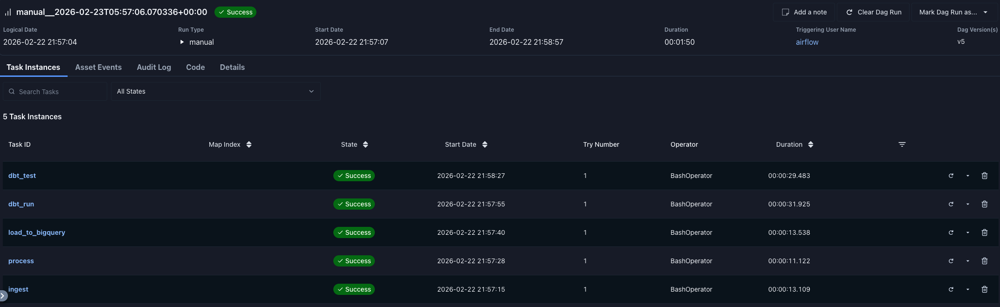

# Financial Data Pipeline

End-to-end data engineering pipeline that ingests stock market data, processes it at scale, loads it into a cloud warehouse, and runs on an automated schedule — fully containerized with Docker.



---

## What It Does

Pulls 2 years of daily OHLCV data for AAPL, MSFT, GOOGL, AMZN, and TSLA. Cleans and validates it with PySpark. Loads it into BigQuery. Transforms it with dbt. Runs the whole thing automatically on a weekday schedule via Airflow — all inside Docker containers.

```
Yahoo Finance API
      ↓
Python Ingestion (yfinance)
      ↓
PySpark Processing (schema validation, quality checks, derived metrics)
      ↓
Google BigQuery (3-layer data model)
      ↓
dbt Transformations (staging → fact → aggregate)
      ↓
Apache Airflow (scheduled orchestration, Docker)
```

---

## Stack

| Tool | Purpose | Why this over alternatives |
|------|---------|---------------------------|
| PySpark | Data processing | Scales to any data volume; pandas would work for 5 tickers but not 5000 |
| BigQuery | Cloud warehouse | Free tier, serverless, standard in DE roles |
| dbt | Transformations | Industry standard transformation layer; SQL models with tests and lineage |
| Airflow | Orchestration | Production scheduler with retry logic, dependency management, and UI |
| Docker | Deployment | Reproducible environment; solves the "works on my machine" problem |

---

## Data Model

```
raw_stock_prices        ← direct parquet load (owned by bigquery_loader.py)
      ↓
stg_stock_prices        ← dbt view, cleans column names
      ↓
fct_stock_prices        ← dbt table, 7,840 rows, typed + validated
      ↓
agg_stock_prices        ← dbt table, 1 row per ticker, aggregated metrics
```

---

## Project Structure

```
financial-data-pipeline/
├── src/
│   ├── data_ingestion.py       # yfinance fetch, metadata logging
│   ├── data_processing.py      # PySpark transforms, quality checks, parquet output
│   └── bigquery_loader.py      # BigQuery dataset + table creation
├── financial_pipeline_dbt/
│   ├── models/
│   │   ├── staging/            # stg_stock_prices (view)
│   │   └── marts/              # fct_stock_prices, agg_stock_prices (tables)
│   └── tests/                  # custom data quality tests
├── airflow-docker/
│   ├── dags/
│   │   └── financial_pipeline_dag.py   # full pipeline DAG
│   └── Dockerfile              # custom Airflow image with Java + dependencies
├── data/
│   ├── raw/                    # CSV files (gitignored)
│   └── processed/              # Parquet files partitioned by Ticker (gitignored)
└── requirements.txt
```

---

## Data Quality

The pipeline fails fast on bad data — if any check fails, downstream tasks don't run:

- Null checks on all key columns
- Negative price detection (physically impossible)
- High < Low violations (data integrity check)
- Daily return range validation (-50% to +50%)
- dbt schema tests: not_null, unique, accepted_values

---

## Setup

**Prerequisites:** Docker Desktop, Google Cloud account, gcloud CLI

**1. Clone the repo**
```bash
git clone https://github.com/Swapnil-Dubey/financial-data-pipeline.git
cd financial-data-pipeline
```

**2. Authenticate with Google Cloud**
```bash
gcloud auth application-default login
gcloud auth application-default set-quota-project financial-data-pipeline-488207
```

**3. Configure dbt**

Create `~/.dbt/profiles.yml`:
```yaml
financial_pipeline_dbt:
  outputs:
    dev:
      type: bigquery
      method: oauth
      project: financial-data-pipeline-488207
      dataset: financial_pipeline
      threads: 1
      timeout_seconds: 300
      location: US
  target: dev
```

**4. Start Airflow**
```bash
cd airflow-docker
docker compose up -d
```

Go to `localhost:8080` (credentials: `airflow` / `airflow`), trigger the `financial_pipeline` DAG.

---

## Running Manually

```bash
python -m venv venv && source venv/bin/activate
pip install -r requirements.txt

python src/data_ingestion.py
python src/data_processing.py
python src/bigquery_loader.py

cd financial_pipeline_dbt
dbt run
dbt test
```
